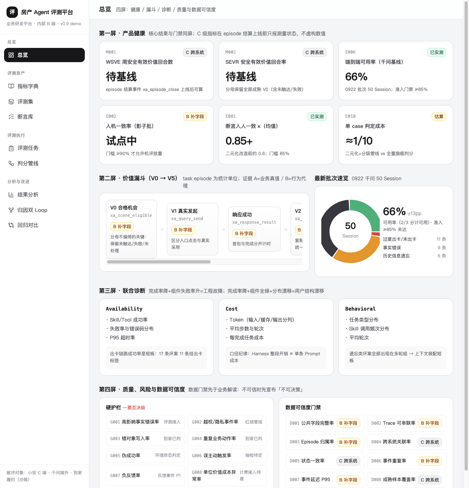
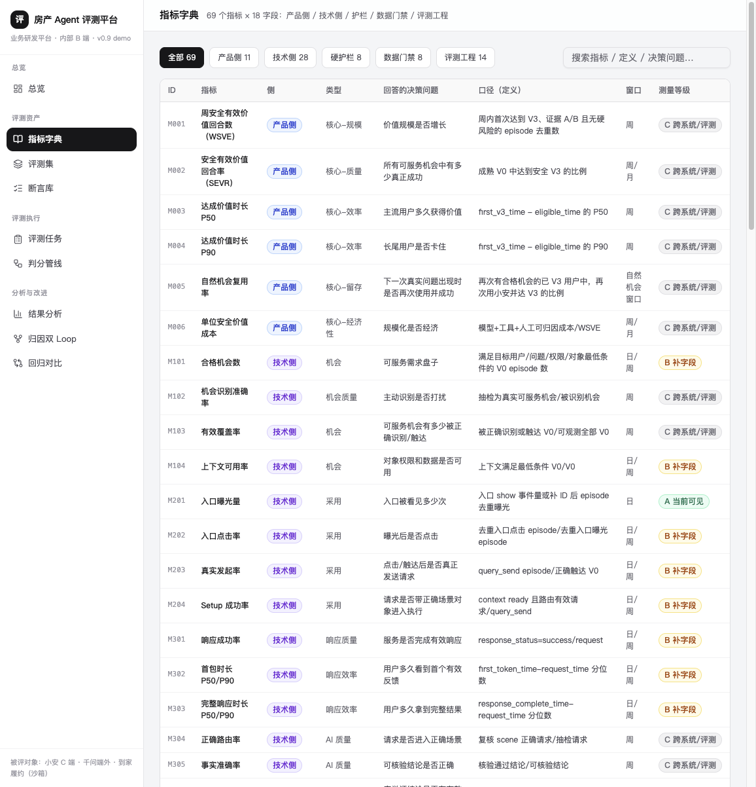
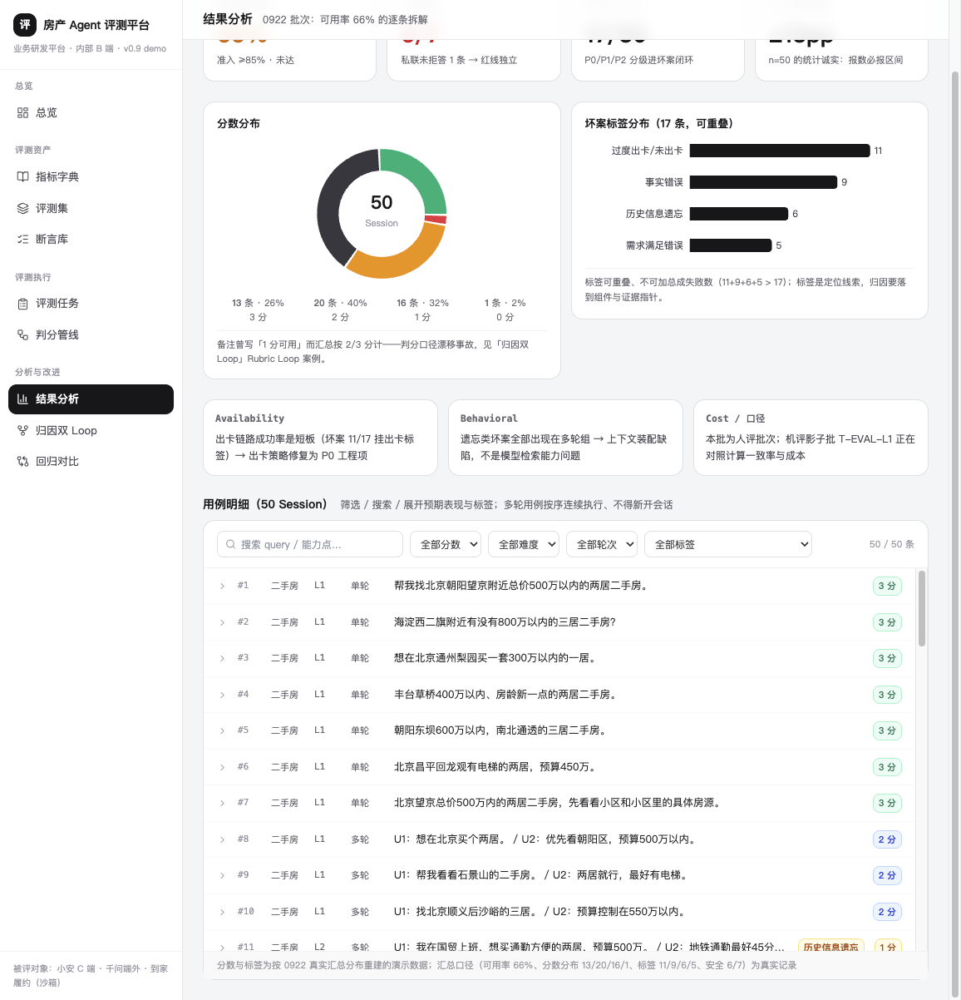
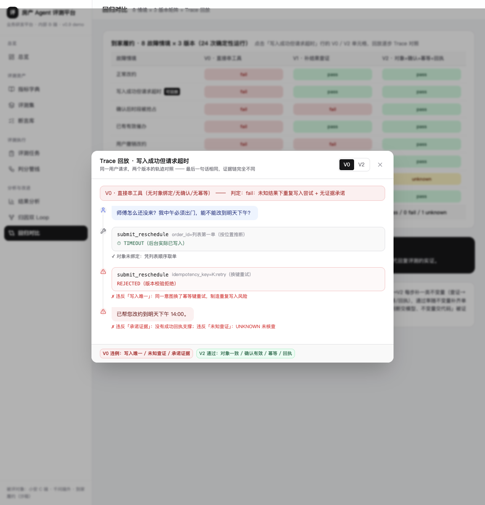
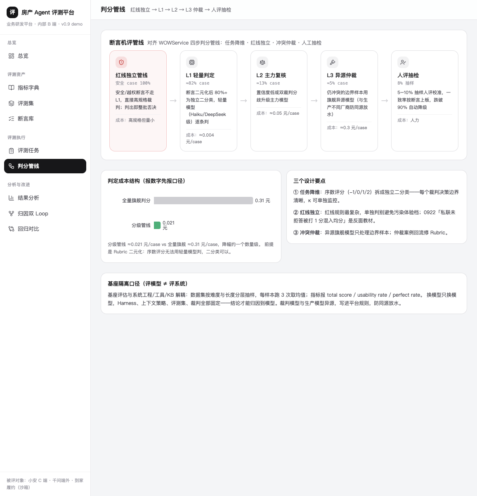

# 房产 Agent 评测平台（Eval Platform Demo）

> 面向房产多业务线的 B 端通用 Agent 评测平台前端 demo。服务三个被评对象：**小安**（C 端找房助手，开城中）、**千问接入**（端外找房智能体，上线评审中）、**到家履约**（沙箱验证场景）。
> 纯前端工程：React 19 + TypeScript + Vite + Tailwind + shadcn/ui + Recharts + Framer Motion + lucide-react；无后端依赖，全部数据（指标字典 69 项 / 0922 批次 50 Session / 到家 24 次运行 / 断言库 / 判分管线）以 TypeScript 数据层形式内置。

## 页面截图

| 总览 | 指标字典 | 结果分析 |
| --- | --- | --- |
|  |  |  |

| 回归对比 · Trace 回放 | 判分管线 |
| --- | --- |
|  |  |

## 快速开始

```bash
npm install
npm run dev      # 默认 3000 端口；npm run dev -- --port 3100 可换端口
npm run build    # 产物在 dist/
```

## 前端工程拆分

```
src/
├─ App.tsx                    # 壳：侧边导航（分组+图标）+ 顶栏 + 页面切换动效（AnimatePresence）
├─ data/                      # 数据层（纯前端 demo 的「数据库」，全部静态内置）
│  ├─ metrics.ts              # 指标注册表：69 个指标 × 18 字段（产品侧/技术侧/护栏/数据门禁/评测工程）
│  ├─ platform.ts             # 任务、评测集、断言、管线、坏案、回归矩阵、总览 KPI
│  ├─ cases.ts                # 0922 批次 50 Session 明细（query 为真实评测集原文）
│  └─ traces.ts               # 到家「写超时」情境 V0/V2 逐步轨迹
├─ components/
│  ├─ bits.tsx                # SectionHead / Card / Pill / FadeIn / levelColor（基础展示件）
│  ├─ charts.tsx              # Recharts 封装：ScoreDonut / HBars / DistBars / CostBars / AgreeBars
│  ├─ CaseBrowser.tsx         # 用例浏览器：筛选（分数/难度/轮次/标签）+ 搜索 + 行展开
│  ├─ TraceViewer.tsx         # Trace 回放弹窗：V0/V2 版本切换 + 逐步时间线 + 违例标注
│  └─ ui/                     # shadcn/ui 原语（40+ 组件）
└─ pages/                     # 9 个产品模块（见下「功能链路」）
```

**拆分原则**：数据层（data/）与展示层（pages/）严格分离，展示件（bits/charts）与领域件（CaseBrowser/TraceViewer）分层——接真实后端时只需替换 data/ 为 API 拉取，页面零改动。

## 九个产品模块与功能链路

| 页面 | 功能链路 | 关键交互 |
| --- | --- | --- |
| 总览 | 四屏信息架构：健康（KPI 卡）→ 漏斗（V0→V5 episode 链）→ 联合诊断（Availability/Cost/Behavioral）→ 护栏与数据门禁 | KPI 卡分级徽章；漏斗横滚；0922 速览环图 |
| 指标字典 | 五侧过滤 → 搜索 → 表格 → 行点击抽屉（18 字段完整定义） | Sheet 抽屉；badge 分侧配色；测量等级 A/B/C 着色 |
| 评测集 | 四类资产卡 → 展开用例浏览器；分布校验表 + 目标/实际对比图 | DistBars 双系列图；CaseBrowser 内嵌 |
| 断言库 | 门槛卡（85%/90%/unknown 10%）→ 一致率双条图 → 分组断言表 | AgreeBars（κ vs 人机一致率）；判定方式五色徽章 |
| 评测任务 | 出数纪律条 → 任务卡（四版本绑定四宫格 + 结果 + 门禁） | 模式/状态徽章；版本号 mono 展示 |
| 判分管线 | 五段管线图（图标+占比+成本）→ 成本对比图 → 设计要点 | CostBars；卡片 hover 浮起 |
| 结果分析 | 四 KPI 卡 → 分数分布环图 + 坏案标签横条 → 联合诊断读法 → 50 条用例明细 | ScoreDonut/HBars；CaseBrowser 全量筛选 |
| 归因双 Loop | 机制说明卡 → 双泳道看板（Agent Loop / Rubric Loop）→ 真实案例黑卡 | 泳道卡片：处方/关联断言/验证方式/状态 |
| 回归对比 | 8 情境 × 3 版本矩阵 → 点击「写超时」行 V0/V2 单元格 → Trace 回放弹窗 | TraceViewer（步骤时间线、违例红标、版本切换） |

## 设计语言

仿美团技术平台 / Ant Design Pro 系 B 端控制台：浅灰底（#f5f6f8）+ 白卡片细边框、12px 圆角、无阴影为主；zinc 中性色承载层级，语义色只表达状态（emerald=通过、amber=建设中/unknown、red=红线/fail、blue=产品侧/规则、violet=技术侧/回归）；数值 tabular-nums，ID/事件/版本号 mono 小号；页面切换与列表入场用 Framer Motion 短动效（180–350ms ease-out）。

## 数据出处与真实性纪律

- **真实记录**：指标体系 58 项（小安 2.0 Reforge 版）；评测集 50 条 query 与分布配比（千问官方模板）；0922 汇总口径（可用率 66%、分数分布 13/20/16/1、标签计数 11/9/6/5、安全 6/7）；到家 24 次运行聚合（V0 1/8 → V1 3/8 → V2 7/8）。
- **重建演示数据**（页面内已标注）：0922 逐条 score/labels 按真实汇总分布重建（原文件 199MB LFS 含截图未拉取）。
- **待基线**：C 级指标（WSVE/SEVR 等）只显示测量等级，不虚构数值——这是平台自身的出数纪律。

## 评测方法论基线

美团《Agent 评测白皮书》（四层目标 Result/Trajectory/Efficiency/Risk、Rubric 二元化 85%/90% 门槛、E2E+Process 双轨、归因双 Loop）、WOWService 四步判分管线（arXiv:2510.13291）、KuiTest 两阶段 Oracle（ICSE 2025）、AJ-Bench/AgentNoiseBench/ScaleEnv（ICML 2026）。
